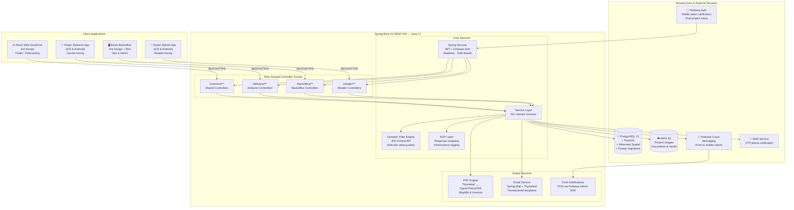
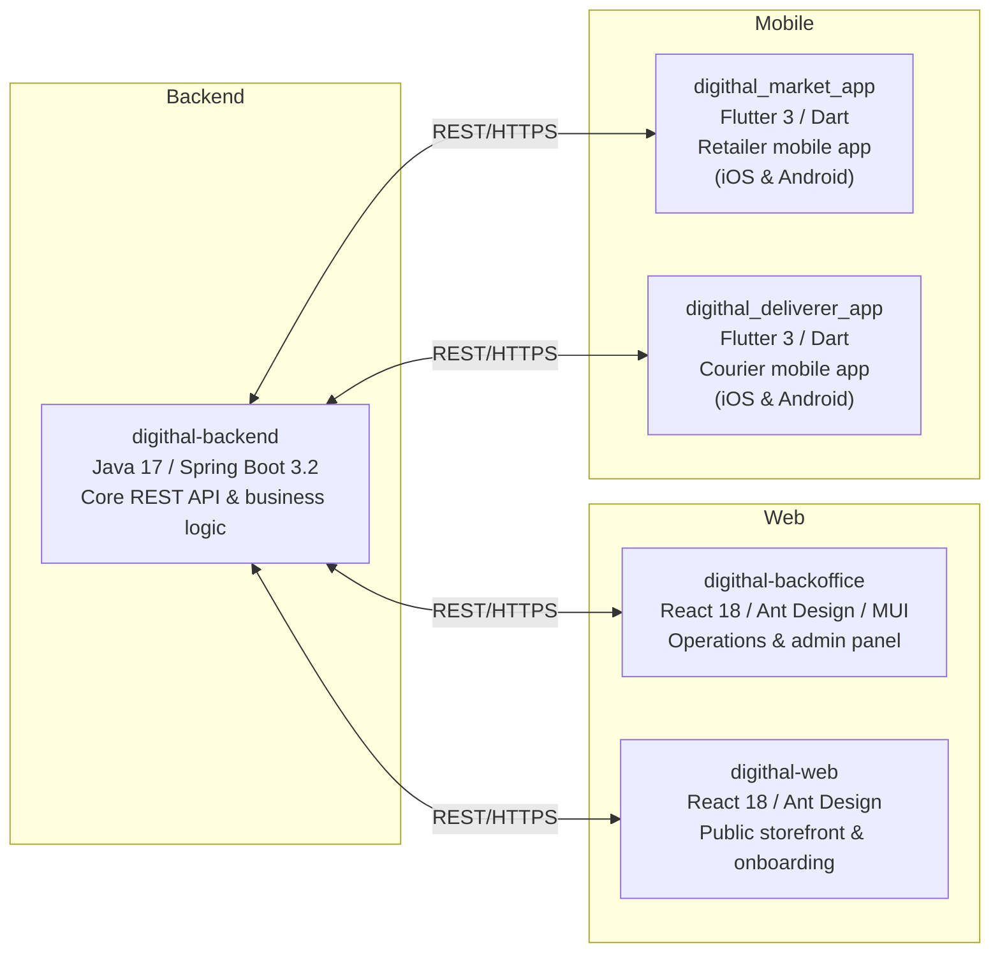
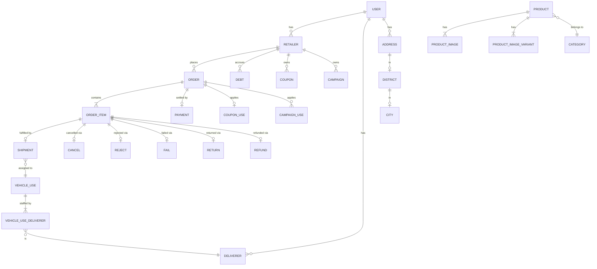
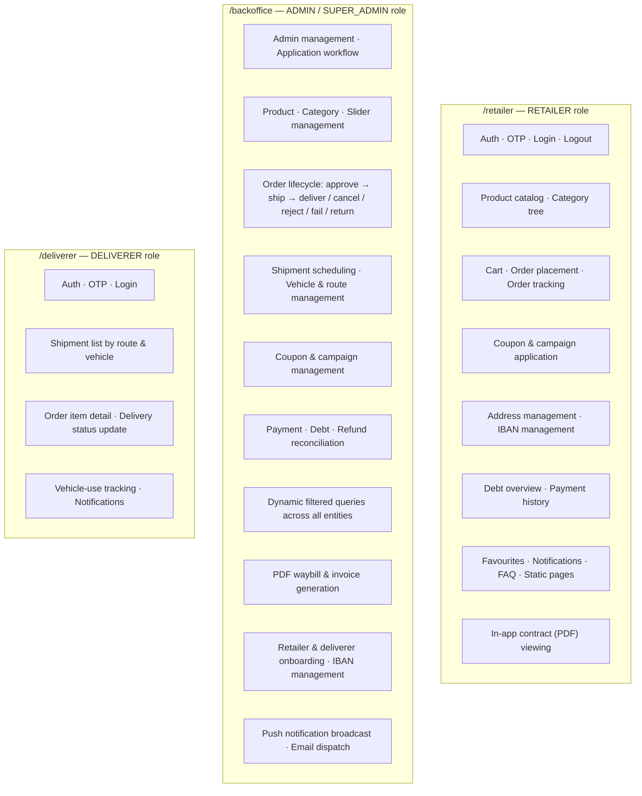
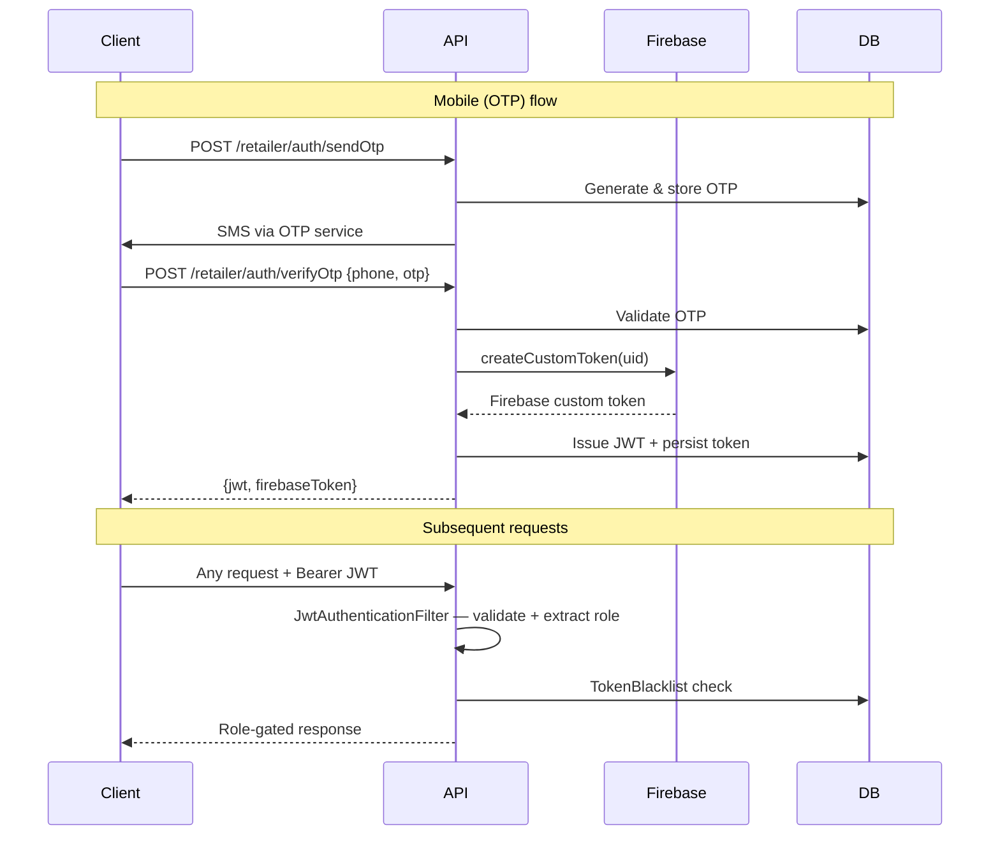
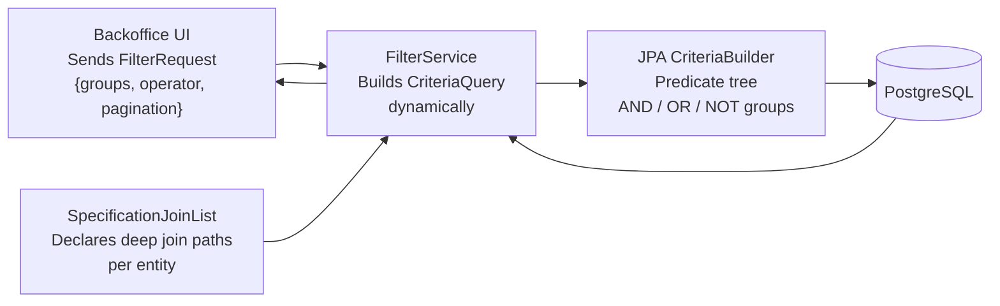
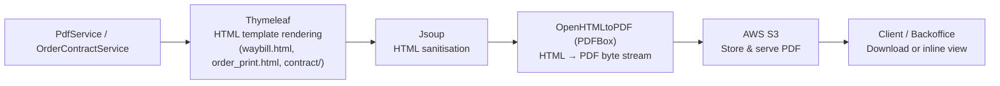
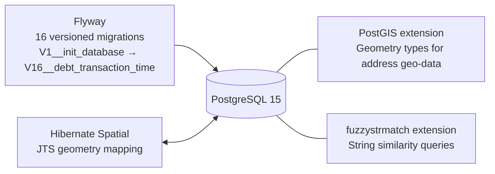
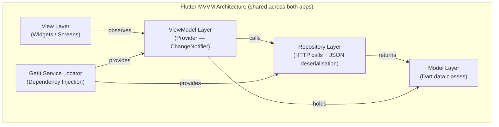
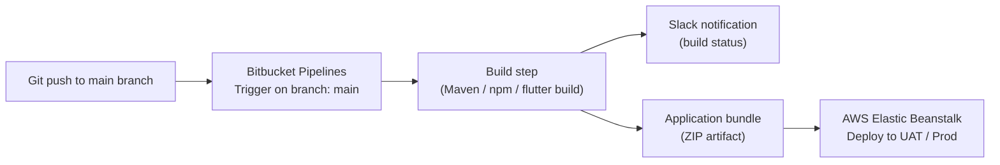

# Digithal — B2B Digital Market & Last-Mile Delivery Platform

> A production-grade, multi-sided B2B marketplace platform connecting retailers with a delivery network — covering the full commercial lifecycle from product catalog and cart management through to geo-routed last-mile delivery, invoicing, and financial reconciliation. Five interconnected applications, ~116,000 lines of code across three technology stacks.

---

## Table of Contents

- [Platform Overview](#platform-overview)
- [High-Level Architecture](#high-level-architecture)
- [Repository Map](#repository-map)
- [Backend — Spring Boot REST API](#backend--spring-boot-rest-api)
  - [Domain Model](#domain-model)
  - [API Surface](#api-surface)
  - [Security Model](#security-model)
  - [Dynamic Filtering Engine](#dynamic-filtering-engine)
  - [Document Generation Pipeline](#document-generation-pipeline)
  - [Cross-Cutting Concerns](#cross-cutting-concerns)
  - [Database & Migrations](#database--migrations)
- [Mobile Applications — Flutter](#mobile-applications--flutter)
  - [Market App (Retailer-Facing)](#market-app-retailer-facing)
  - [Deliverer App (Courier-Facing)](#deliverer-app-courier-facing)
- [Frontend — React Web Applications](#frontend--react-web-applications)
  - [Backoffice Panel](#backoffice-panel)
  - [Web Storefront](#web-storefront)
- [CI/CD](#cicd)
- [Source Code Notice](#source-code-notice)

---

## Platform Overview

Digithal is a B2B marketplace for the fresh produce and grocery supply chain. Retailers (market owners) browse a product catalog, place orders with scheduled delivery dates, and track their orders through to doorstep delivery. A fleet of couriers manages route-based shipments from a dedicated mobile app, while operations staff oversee the entire lifecycle — product management, order approval, shipment scheduling, payment reconciliation, and returns — through a full-featured backoffice panel.

The platform is composed of five production applications:

| Application | Stack | LOC |
|---|---|---|
| `digithal-backend` | Java 17 · Spring Boot 3.2 | ~29,600 |
| `digithal-backoffice` | React 18 · Ant Design · MUI | ~38,600 |
| `digithal_market_app` | Flutter 3 · Dart | ~29,600 |
| `digithal_deliverer_app` | Flutter 3 · Dart | ~15,500 |
| `digithal-web` | React 18 · Ant Design | ~2,400 |

---

## High-Level Architecture

---

## Repository Map

---

## Backend — Spring Boot REST API

The backend is a stateless, layered REST API built with Spring Boot 3.2 and Java 17. It exposes three distinct, role-gated API contexts (`/retailer`, `/backoffice`, `/deliverer`) plus a shared `/common` namespace, each served by a dedicated controller group.

**Core dependencies:**

| Concern | Technology |
|---|---|
| Web framework | Spring Boot 3.2 · Spring MVC |
| Security | Spring Security 6 · JJWT 0.11.5 · Firebase Admin SDK 9.1.1 |
| Persistence | Spring Data JPA · Hibernate Spatial · Flyway 10 |
| Database | PostgreSQL 15 · PostGIS |
| Reactive HTTP client | Spring WebFlux (`WebClient`) |
| Object mapping | ModelMapper 3.1 · Jackson (JSR-310) |
| Validation | Spring Validation · Bean Validation 3 (custom annotations) |
| Document generation | Thymeleaf 3.1 · OpenHTMLtoPDF 1.0.10 · Jsoup 1.17 |
| Cloud storage | AWS SDK (S3) |
| Notifications | Firebase Admin SDK (FCM) |
| Email | Spring Mail + Thymeleaf templates |
| API docs | SpringDoc OpenAPI 2.2 (Swagger UI) |
| Observability | Spring Boot Actuator + custom `InfoContributor` |
| Code generation | Lombok |

### Domain Model

The schema encompasses 50+ entities across the following bounded domains:

### API Surface

### Security Model

Authentication is stateless and role-separated across two Firebase projects (one for retailers, one for deliverers) alongside a standard email/password flow for backoffice admins.

- **JWT** (JJWT 0.11): issued on login, stored and blacklisted on logout — no session state on the server.
- **Firebase tokens**: mobile clients receive a Firebase custom token alongside the JWT, enabling Firebase SDK features (Analytics, FCM) on-device.
- **Dual Firebase projects**: retailer and deliverer apps operate under separate Firebase service accounts, preventing cross-context authentication.
- **Role-based URL authorization**: `/retailer/**` requires `RETAILER`, `/backoffice/**` requires `ADMIN` or `SUPER_ADMIN`, `/deliverer/**` requires `DELIVERER`. Enforced at the `SecurityFilterChain` level with a custom `ExceptionHandlerFilter` to produce consistent error responses before the authentication filter chain.

### Dynamic Filtering Engine

A custom query engine built on the JPA Criteria API enables the backoffice to perform arbitrarily complex filtered, sorted, and paginated queries across any entity — without writing ad-hoc JPQL per screen.

Filters support nested join traversal (e.g. `shipment → orderItem → order → deliveryAddress → district → city`), multiple operators (`EQ`, `LIKE`, `GT`, `LT`, `BETWEEN`, `IN`), group-level AND/OR composition, and runtime sort field resolution through the same join path declarations. This makes the filtering engine fully reusable across all backoffice entity types (orders, shipments, retailers, deliverers, products, payments, coupons, campaigns, etc.) with zero duplicated query code.

### Document Generation Pipeline

Waybills and order print documents are rendered via Thymeleaf HTML templates, sanitised with Jsoup, converted to PDF by OpenHTMLtoPDF, and stored on S3. Retailer contracts are served as in-app PDFs through the market app's built-in PDF viewer.

### Cross-Cutting Concerns

Two AOP aspects cover all controllers and services uniformly:

- **`ResponseWrappingAspect`** — wraps every controller return value in a consistent `ResponseSuccess<T>` envelope, eliminating boilerplate across 100+ endpoints.
- **`LoggerAspect`** — instruments every service method with entry/exit logging, millisecond execution timing, and authenticated principal capture. Exception paths are independently logged with full signature and cause. Three environment-specific Logback profiles (`dev`, `uat`, `prod`) manage log verbosity and appenders.

Custom constraint annotations (`@PasswordValidator`, `@FieldsValueMatch`, `@AddShipmentRequestValidator`, `@FilterRequestValidator`) centralize validation logic outside controller and service code.

### Database & Migrations

Schema evolution is fully managed through 16 Flyway versioned migrations, from initial schema creation through incremental additions (debt tracking, waybill paths, invoice paths, TCKN handling, realized quantities, etc.). PostGIS and `fuzzystrmatch` extensions are provisioned as part of the baseline migration. Spatial address data uses JTS geometry types mapped via Hibernate Spatial, enabling geo-queries on delivery coordinates.

---

## Mobile Applications — Flutter

Both mobile apps share the same architectural pattern: **MVVM** with `Provider` for reactive state management, `GetIt` for compile-time dependency injection, and a repository layer abstracting all HTTP communication. The `http` package handles all network calls, with JWT tokens injected via a custom token-intercepted client wrapper. Session state persists across app restarts via `shared_preferences`.

### Market App (Retailer-Facing)

**Version:** 3.3.0+22 | **Platforms:** iOS & Android

The primary B2B commerce interface for retailers. Handles the full shopping flow from browsing to order placement and real-time tracking.

**Key features:**
- Product catalog with hierarchical category browsing and search
- Staggered grid product listing with cached network images and carousel sliders
- Cart management with real-time coupon and campaign application
- Multi-state order tracking (placed → approved → shipped → delivered / cancelled / rejected / failed / returned)
- OTP-based phone number authentication with PIN input
- In-app PDF contract viewing (`flutter_cached_pdfview`)
- Firebase push notifications with local notification scheduling
- Firebase Analytics integration for user behavior tracking
- IBAN management and debt overview
- Favourites, FAQ, static content pages, and rich-text HTML content rendering (`flutter_widget_from_html`)
- Multi-language support via ARB-based localization (`intl` + `intl_utils`)

**Selected packages:**

| Package | Purpose |
|---|---|
| `provider` ^6.1 | Reactive state management (MVVM) |
| `get_it` ^8.0 | Dependency injection / service locator |
| `firebase_messaging` ^15.1 | Push notifications |
| `firebase_analytics` ^11.2 | Usage analytics |
| `flutter_local_notifications` ^17.2 | Local notification scheduling |
| `flutter_cached_pdfview` ^0.4 | In-app PDF viewing |
| `pinput` ^5.0 | OTP / PIN input UI |
| `carousel_slider` ^5.0 | Hero image carousels |
| `flutter_staggered_grid_view` ^0.7 | Variable-height grid layouts |
| `cached_network_image` ^3.3 | Image caching & placeholders |
| `dropdown_search` ^5.0 | Searchable dropdowns |
| `flutter_rating_bar` ^4.0 | Product rating UI |
| `intl` + `intl_utils` | i18n / ARB localizations |
| `shared_preferences` ^2.2 | Local session persistence |

### Deliverer App (Courier-Facing)

**Version:** 1.0.0 | **Platforms:** iOS & Android

A purpose-built operational tool for delivery personnel. Designed for speed and simplicity in field conditions.

**Key features:**
- Shipment list grouped by delivery route and vehicle use assignment
- Order item detail view with product and delivery address information
- Real-time delivery status update submission (delivered / failed / returned)
- Vehicle-use session tracking
- Push notifications for new assignments and dispatch updates
- OTP phone authentication
- Multi-language support via ARB localization

---

## Frontend — React Web Applications

### Backoffice Panel

A feature-rich internal operations tool built with React 18. Serves admins and operations managers for end-to-end platform control.

**Tech stack:** React 18 · React Router DOM v6 · Ant Design 5 · Material UI v4 · Axios · Moment.js

**Notable capabilities:**

- **Dynamic filter UI** — mirrors the backend's filter engine; operations staff can compose multi-field, multi-condition queries across every entity type with AND/OR group logic.
- **Drag-and-drop** — `@dnd-kit` (core + sortable) powers reorderable content such as product image variants and sliders.
- **Rich text editing** — `react-quill` for formatted content entry (static pages, FAQ, product descriptions).
- **Excel export** — `xlsx` library enables one-click spreadsheet export of any filtered data set (orders, payments, debt reports).
- **Phone input** — `react-phone-input-2` for internationalized phone number entry with country flag support.
- **Shipment & waybill management** — triggers backend PDF generation and presents print-ready waybill documents inline.
- **Order lifecycle management** — UI workflows for approval, rejection, cancellation, failure logging, return processing, and refund reconciliation, each calling dedicated backend endpoints with structured request payloads.

### Web Storefront

A lightweight public-facing React 18 application serving retailer onboarding and informational content.

**Tech stack:** React 18 · React Router DOM v6 · Ant Design 5 · Axios

**Pages:** Landing, Privacy Policy, Price List (with filterable product model grid), Delete Account. Acts as the public entry point for new retailer acquisition and app store redirect links.

---

## CI/CD

All five repositories include **Bitbucket Pipelines** configuration. The backend pipeline is configured to build the Spring Boot fat JAR and deploy to **AWS Elastic Beanstalk** (UAT and production environments) with versioned deployment labels (`APPLICATION_NAME-BUILD_NUMBER-COMMIT_HASH-TIMESTAMP`). Frontend pipelines produce optimized static builds (`GENERATE_SOURCEMAP=false`). Successful pipeline runs post notifications to a **Slack webhook**, giving the team real-time build status visibility.

---

## Source Code Notice

Source code is proprietary. All intellectual property rights are retained by the original employer. This repository documents architecture, technology choices, and feature scope for portfolio purposes only.

> *Full-stack portfolio project demonstrating production experience across Java/Spring Boot, Flutter (iOS & Android), React, PostgreSQL with spatial extensions, AWS, and Firebase — deployed to real users in a B2B supply chain context.*
